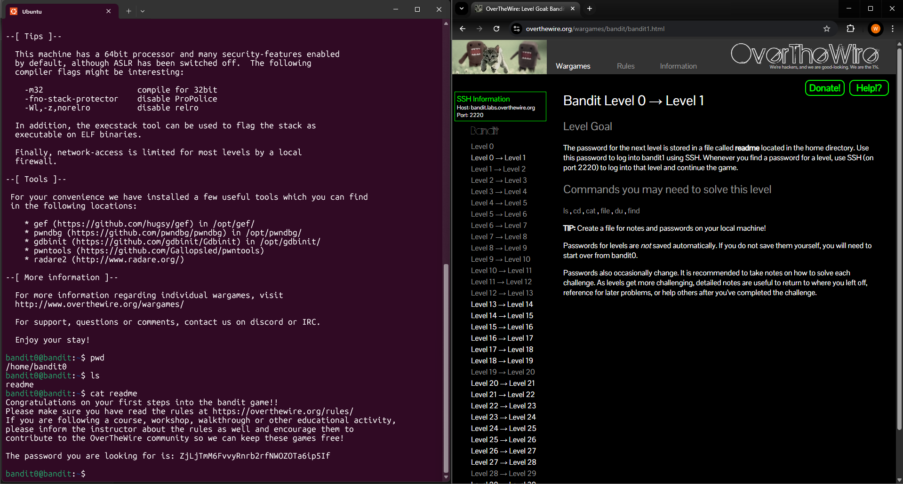

# Level 0 > 1

Goal: The password for the next level is stored in a file called readme located in the home directory.

---

## What I Did: 

- Once logged in i ran pwd to confirm i was in the home directory.
- I then used ls to list contents of the directory and found the file readme.
- I then used the cat command to read the file and retrieve the password.

Password Found: ZjLjTmM6FvvyRnrb2rfNWOZOTa6ip5If

---

## What did i learn?

In this level, I learned how to navigate a Linux-based system using basic command-line tools.

- pwd to confirm my current directory.
- ls to list the files in the directory.
- cat to display the contents of a file.

This actually helped me understand the importance of understanding the file system structure and using simple commands to locate and read files which in my opinion are key skills for working in terminal environments.