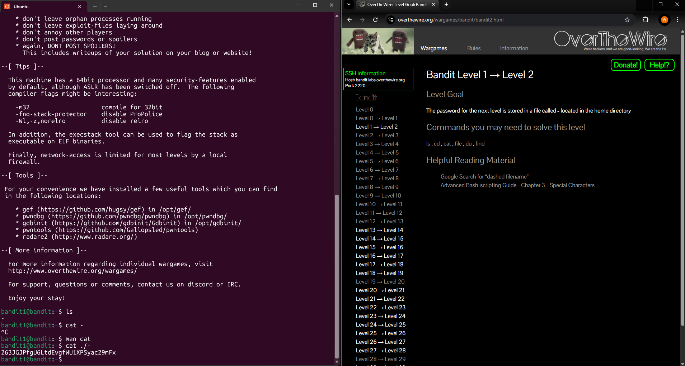

# Level 1 > 2

Goal: The password for the next level is stored in a file called - located in the home directory.

## What I Did:

- I first ran the command ls to list current files in the home directory.
- I found a file named - , initially i thought i could just use the command cat - however it did not work as expected.
- I found out that - is interpreted as a standard input (stdin) after checking man cat page which is amazing to understand commands.
- After reading what the page gave me i found out that to accomplish this level, i needed to use ./- which treats it as a file in the current directory and avoids confusion with stdin.

Password Found: 263JGJPfgU6LtdEvgfWU1XP5yac29mFx

## What Did I Learn?

In this level, I learned how to handle files with special names and how to take advantage of man cat to understand the capabilities of the command I was running. This helped me realize how certain filenames can clash with command syntax, and how using relative paths like ./ can resolve that.

It also reinforced the importance of reading documentation to better understand and troubleshoot command-line tools.
