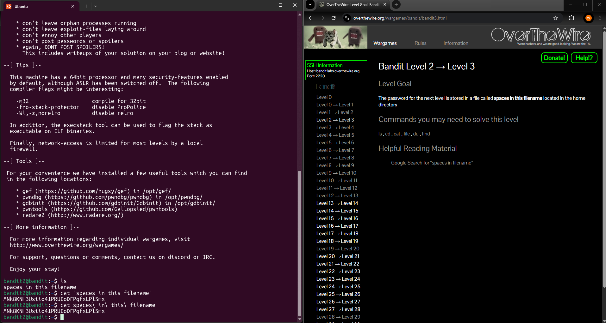

# Level 2 > 3

Goal: The password for the next level is stored in a file called spaces in this filename located in the home directory.

## What I Did:

- First of all i started by using the command ls to list all files in the current directory and found a file called spaces in this file name.
- I knew that spaces in filenames can cause issues if actually not handled properly in the shell.
- Spaces in filenames confuse the shell because it splits arguments on spaces. If not quoted or escaped, a filename like spaces in this filename becomes five arguments: spaces, in, this, filename, causing errors.
- So for me to solve this, I used quotes to treat the entire filename as a single argument:
    
    cat “spaces in this filename”
    
- Another way is to include backslashes like this:
    
    cat spaces\ in\ this\ filename
    

Password Found: MNk8KNH3Usiio41PRUEoDFPqfxLPlSmx

## What Did I Learn?

In this level, I learned that filenames with spaces need special handling because, by default, the shell treats each word separated by spaces as a separate argument. To make the shell treat the entire filename as a single argument, I discovered two methods: enclosing the filename in quotes or escaping the spaces with backslashes.