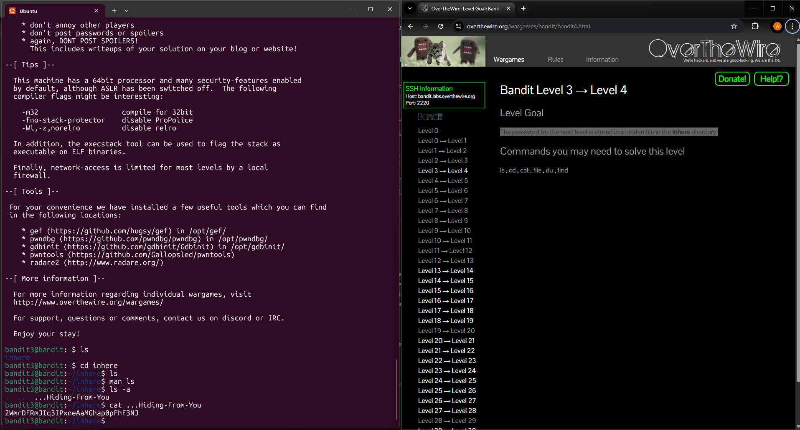

# Level 3 > 4

Goal: The password for the next level is stored in a hidden file in the inhere directory.

## What I Did: 

- I ran ls in the home directory and found a subdirectory named inhere.
- I used cd inhere to enter the directory
- Once inside, I ran ls, but nothing was displayed.
- To investigate further, I ran man ls to learn more about the command and discovered the -a option, which shows hidden files.
- I ran ls -a and a file named …Hiding-From-You appeared.
- I ran cat …Hiding-From-You to read the contents of the file and found the password.

Password Found: 2WmrDFRmJIq3IPxneAaMGhap0pFhF3NJ

## What Did I Learn? 

In this level, I learned that files starting with a . are hidden by default in Linux. Using the command ls -a is very useful for revealing these hidden files and directories. 

Once again, manual pages (man) proved to be a great way to explore command options and deepen my understanding of how things work. 

It also made me think — information like passwords is often stored in places that aren’t immediately visible. So, knowing how to reveal and read hidden files is a key skill when navigating and investigating in a Linux environment.