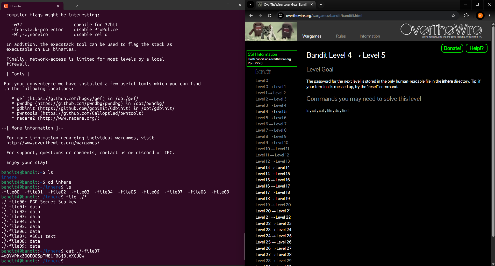

# Level 4 > 5

Goal: The password for the next level is stored in the only human-readable file in the inhere directory.

## What I Did:

- I first ran the command ls and a directory appeared named inhere so i ran the command cd inhere.
- Once inside the directory i ran the command ls and 10 files appeared - i did not want to use the command cat to read each individual file to see if the password was inside it.
- I remembered from Level 1 > 2 that file names starting with - can confuse commands so this is where i used the command file.
- Using the command file would determine the type of file it is, the reason i wanted to do this because in the level goal it specifically says the password is stored in a human-readable file.
- I used the command file ./\* and made sure to prefix them with ./
- This worked perfectly and the output i found was: ./-file07: ASCII text
- This told me that the -file07 is the only file containing actual readable text.
- Recalling from Level 1 > 2 I used the command ./-file07 to safely cat the content

Password Found: 4oQYVPkxZOOEOO5pTW81FB8j8lxXGUQw

## What Did I Learn?

In this level, I learned how to identify the only human-readable file among many by using the command file and remembered how to safely handle files with names starting with a dash. More importantly how to actually extract the content without blindly opening every file.