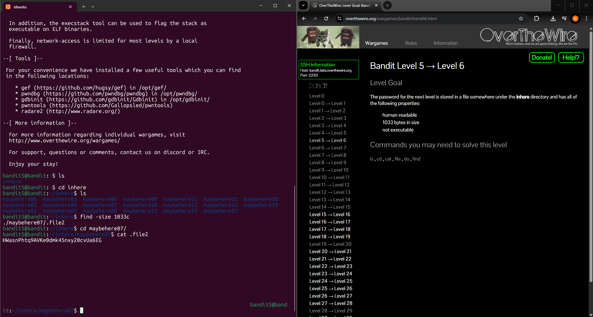

# Level 5 > 6

Goal:
The password for the next level is stored in a file somewhere under the inhere directory and has all of the following properties:

- human-readable
- 1033 bytes in size
- not executable

## What I Did:

- I first ran the command ls and a directory appeared named inhere so i ran the command cd inhere.
- I then used the command ls to list whats inside the directory and found loads of directorys.
- In the goal it said the file we are looking for is 1033 bytes in size so i ran the command find -size 1033c and showed me all the files thats 1033 bytes in size
- I then changed directory to maybehere07 and ran the command cat .file2 which then showed me the password.

Password Found: HWasnPhtq9AVKe0dmk45nxy20cvUa6EG

## What Did I Learn?

In this level I learned how to use find to search for a file by its exact size, and used cat to read the file and get the password. This was fairly simple but understanding the find command is crucial in challenges like these.
