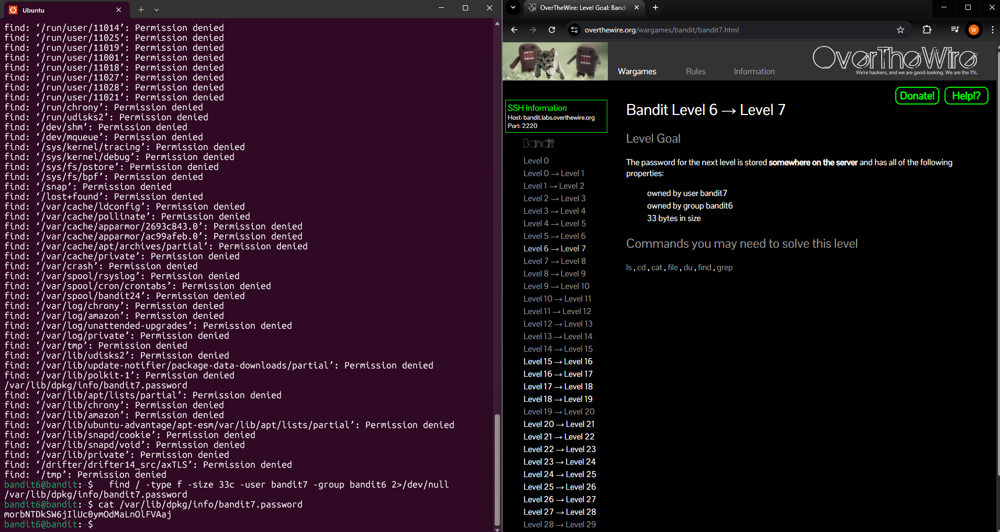

# Level 6 > 7

Goal:
The password for the next level is stored somewhere on the server and has all of the following properties:

- owned by user bandit7
- owned by group bandit6
- 33 bytes in size

## What I Did:

- I first ran the command find / -type f -size 33c -user bandit7 -group bandit6 but it showed alot of permission denied messages
- I re-ran the command but to make the output cleaner, I redirected the errors to /dev/null typing this 2>/dev/null
- Now it is all cleaned up it showed me the correct file
- I then used the command cat to read its contents and the password was found!

Password Found: morbNTDkSW6jIlUc0ymOdMaLnOlFVAaj

## What Did I Learn?

In this level i learned how to clean up the output and how to redirect errors with the command 2>/dev/null which is amazing, it made it much easier to spot the correct file.
