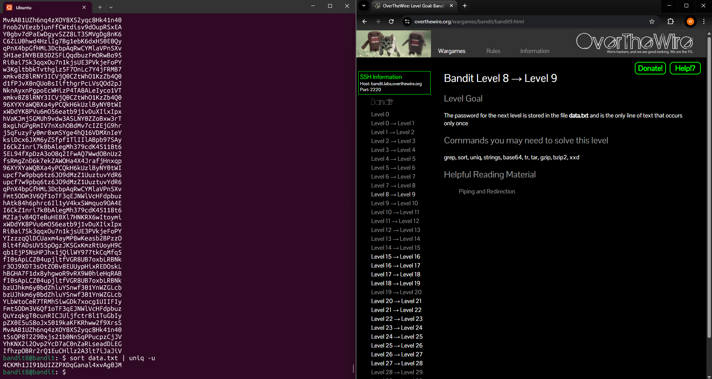

# Level 8 > 9

Goal:
The password for the next level is stored in the file data.txt and is the only line of text that occurs only once

## What I Did

- At first i checked on the bandit website for suggested commands.
- Because the file had many repeated lines i thought to myself that uniq would help in this.
- I decided to use the command man sort and man uniq to find out abit more information, i learned that uniqu -u would print unique lines but requires sorted input.
- So i used the command sort data.txt | uniq -u and found the password!

Password Found: 4CKMh1JI91bUIZZPXDqGanal4xvAg0JM

## What Did I Learn?

In this level I realized uniq -u could help but learned it needs sorted input, so I ran sort data.txt | uniq -u. That gave me the password. Along the way, I learned how useful sort, uniq, and man pages can be for solving these kinds of problems.
