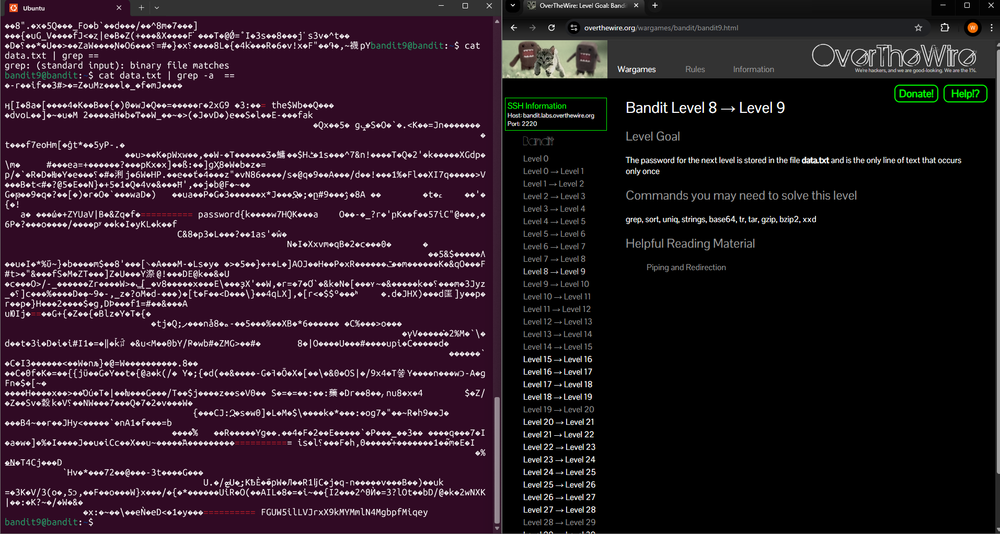

# Level 9 > 10

Goal:
The password for the next level is stored in the file data.txt in one of the few human-readable strings, preceded by several = characters.

## What I Did:

- First of all i ran ls to see the file
- I used cat data.txt but it came back with binary or non-readable content
- I checked the hint for this level so i would check for strings preceded with multiple = characters
- The regular grep command failed so i added -a to treat binary as text and found the password!

Password found: FGUW5ilLVJrxX9kMYMmlN4MgbpfMiqey

## What Did I Learn?

In this level i learned how to handle binary files and use grep more flexibly.
